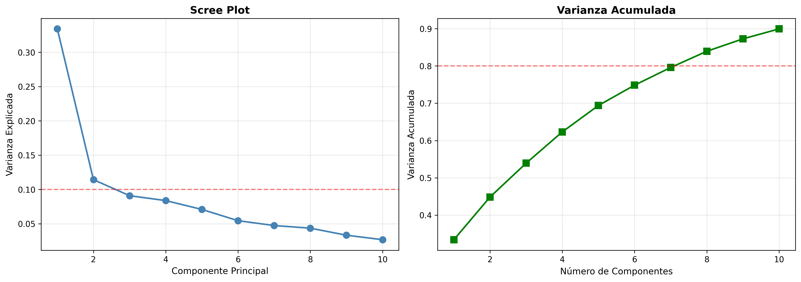
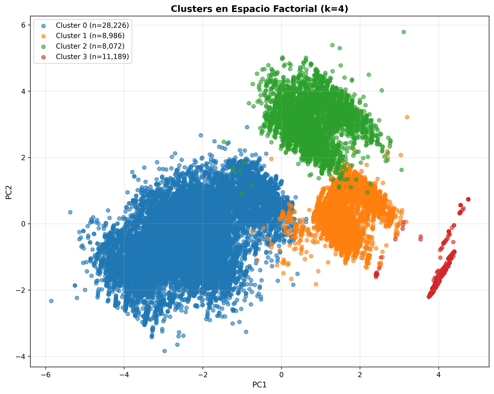
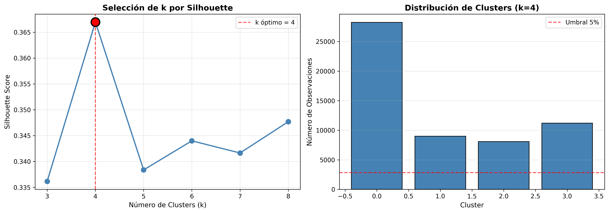
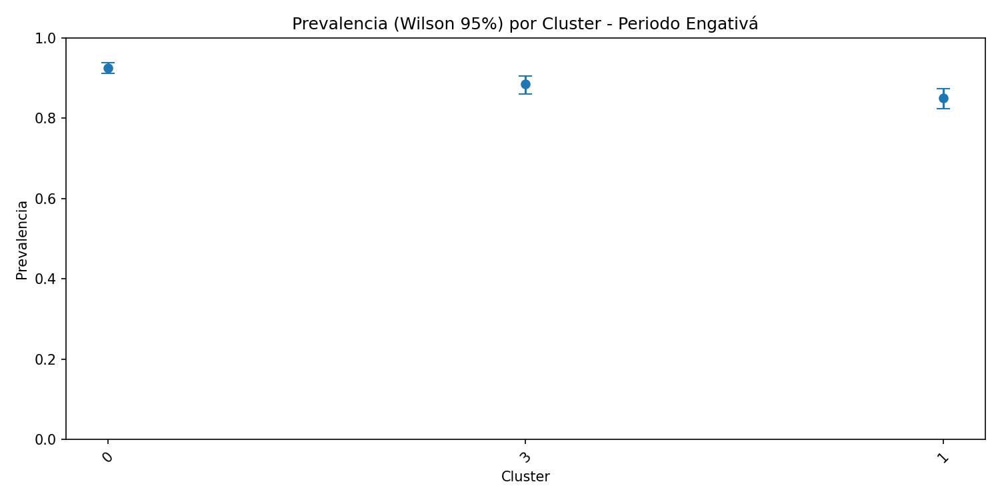
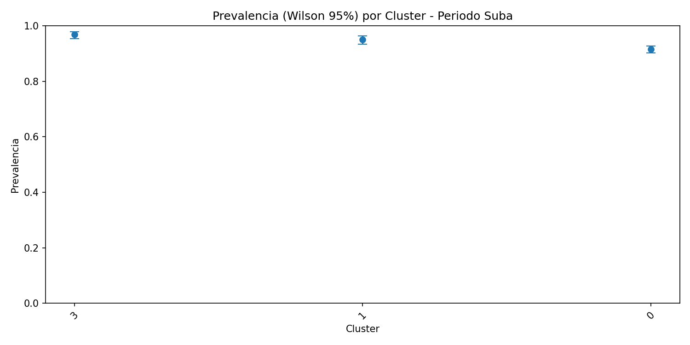

# Análisis de Datos NNA (Niños, Niñas y Adolescentes) - Trabajo Infantil en Bogotá

## Resumen Ejecutivo

Proyecto de análisis de datos sobre el Programa de Identificación y Desvinculación de Niñas, Niños y Adolescentes (NNA) de la Actividad Laboral de la Secretaría Distrital de Salud de Bogotá (2013-2025). El análisis utiliza la metodología **CRISP-DM** para caracterizar perfiles, identificar patrones territoriales y medir tasas de desvinculación del trabajo infantil.

**Datos procesados:** 56,473 registros | **Variables:** 48 | **Territorios:** 20 localidades, 119 UPZ

---

## Estructura del Proyecto
```
NNA_7/
├── data/
│   ├── raw/                      # Datos originales
│   │   └── Data_Limpia.xlsx      # Base operativa (10.9 MB)
│   └── processed/                # Datos procesados
│       ├── base_clean.parquet    # Dataset limpio (56,473 filas)
│       ├── target_trabaja.parquet # Variable objetivo binaria
│       ├── factor_scores.parquet  # Scores de PCA
│       └── cluster_assign.parquet # Asignaciones de clusters
├── src/                          # Scripts de análisis
│   ├── 01_data_understanding.py  # EDA y limpieza
│   ├── 02_target_engineering.py  # Construcción variable objetivo
│   ├── 03_factor_analysis.py     # Análisis de componentes principales
│   ├── 04_clustering.py          # Segmentación K-Medoids
│   └── 05_Upz.py                 # Análisis territorial y prevalencias
├── reports/                      # Resultados y visualizaciones
│   ├── figures/                  # Gráficos (29 PNG)
│   ├── cross/                    # Tablas cruzadas
│   └── analisis_prevalencias_output/ # Prevalencias territoriales
├── Makefile                      # Automatización del pipeline
├── requirements.txt              # Dependencias
└── README.md                     # Este archivo
```

---

## Objetivos del Análisis

### Objetivo Principal
Medir la **prevalencia programática de desvinculación** por periodo y territorio, y explicar los factores asociados a la permanencia en trabajo infantil tras la primera intervención.

### Preguntas de Investigación
1. ¿Cuál es la prevalencia de desvinculación por localidad y UPZ?
2. ¿Qué factores sociodemográficos y territoriales se asocian con la permanencia en trabajo?
3. ¿Existen perfiles diferenciados de NNA que requieran intervenciones específicas?
4. ¿Qué territorios requieren priorización de recursos?

---

## Metodología CRISP-DM

### 1️. Comprensión del Negocio

**Contexto:** Programa de la Secretaría Distrital de Salud de Bogotá para identificar y desvincular NNA del trabajo infantil mediante búsqueda activa en espacios públicos y articulación interinstitucional (ICBF, Subredes de Salud).

**Definición operacional (DANE/OIT):** Un menor es considerado trabajador si en la semana de referencia dedicó al menos 1 hora a un empleo.

**Alcance del análisis:**
- **Población:** NNA atendidos por el programa (no inferencia poblacional)
- **Periodo:** 2021-2025 (múltiples cortes temporales)
- **Unidad de análisis:** Registro de atención por NNA
- **Territorio:** 20 localidades de Bogotá

**Métricas clave:**
- Tasa de desvinculación: Desvinculados / NNA evaluables
- Tiempo a cierre: mediana en días
- Prevalencia territorial: con IC 95% Wilson

### 2️. Comprensión de los Datos

**Fuente:** `Data_Limpia.xlsx` (base operativa depurada)

**Características:**
- **56,473 registros** válidos tras limpieza
- **48 variables** finales (de 115 originales)
- **Distribución territorial:**
  - Top 5 localidades: Ciudad Bolívar (7,957), Bosa (5,774), Kennedy (5,431), Suba (4,931), Usme (3,930)
  
**Tipos de variables:**
- Sociodemográficas: edad, sexo, género, etnia, estado civil
- Territoriales: localidad, UPZ, barrio, estrato
- Educativas: curso de vida, escolaridad
- Laborales: ocupación, tipo de intervención, lugar de trabajo
- Administrativas: fechas, seguimientos, cierres

**Calidad de datos:**
- Valores faltantes: 15-85% según variable
- Tratamiento de NA: código 99999 → `NA`
- Duplicados: consolidados por `id_fic` + `fecha_intervencion`

### 3️. Preparación de Datos

#### Limpieza y normalización
```python
# Estandarización de nombres de columnas
columnas → minúsculas, sin tildes, sin espacios
99999/98/99 → NA explícitos
```

#### **Variable Objetivo: `trabaja`** (binaria 0/1)

**Construcción con lógica de cascada:**
```
Prioridad 1: Campo explícito "dónde trabaja" → 1=Sí, 0=No
Prioridad 2: "trabajo_protegido" = Sí → 1
Prioridad 3: "desvinculado" → invertir (1=desvinculado → trabaja=0; 0=no desvinculado → trabaja=1)
```

**Resultado:**
- `trabaja = 1`: 7,689 (13.6%) - Sigue trabajando
- `trabaja = 0`: 36,609 (64.8%) - Desvinculado/no trabaja
- `NA`: 12,175 (21.6%) - Sin información

**Origen del etiquetado:**
- Explícito: 0 casos
- Trabajo protegido: 26 casos
- **Inferido por "desvinculado"**: 44,272 casos (fuente principal)

**Justificación:** Privilegiar "desvinculado" evita celdas vacías y maximiza cobertura. El 21.6% de NA se reporta explícitamente en todos los análisis.

**Trazabilidad:** `reports/columns_hints.json`, `reports/target_engineering_report.txt`

#### Codificación de variables categóricas
- **Label Encoding** para variables con <50 categorías únicas
- Variables procesadas: 21 numéricas + categóricas codificadas
- Imputación: mediana para numéricas

### 4️ Modelado

#### **Análisis de Componentes Principales (PCA)**

**Objetivo:** Reducir dimensionalidad, estabilizar distancias y eliminar multicolinealidad antes del clustering.

**Configuración:**
- 10 componentes principales
- Varianza explicada acumulada: **89.9%**

**Estructura latente identificada:**

| Componente | Varianza | Interpretación |
|------------|----------|----------------|
| **PC1** (33.4%) | Gradiente sociodemográfico | estrato (+), género (+), ocupación (+), "termina proceso" (−) |
| **PC2** (11.4%) | Dimensión territorial-administrativa | zona (+), sexo (+), afiliación SGSSS (+) |
| **PC3** (9.1%) | Tipo de intervención | operativo y lugar de trabajo |
| **PC5** (7.1%) | **Edad** | Domina este componente (carga 0.698) |

**Hallazgo clave:** La edad **no** es el principal eje de variación. El contexto socioeconómico y operativo explica más varianza que la edad individual.



**Archivos:** `reports/pca_explained_variance.csv`, `reports/factor_loadings.csv`

#### **Clustering: K-Medoids**

**Objetivo:** Identificar perfiles de NNA con características y respuestas diferenciadas.

**Método:** K-Medoids (robusto a outliers vs. K-Means)

**Selección de k:**
- Criterio: Silhouette score + tamaños de clusters balanceados
- Evaluación: k = 3 a 8
- **k óptimo = 4** (Silhouette = 0.367)

**Resultado:**

| Cluster | Tamaño (n) | % Total | Tasa Desvinculación Promedio |
|---------|------------|---------|------------------------------|
| **C0** | 28,226 | 50.0% | ~80.0% |
| **C1** | 8,986 | 15.9% | ~85.6% |
| **C2** | 8,072 | 14.3% | Sin datos válidos (n<30) |
| **C3** | 11,189 | 19.8% | ~86.4% |

**Interpretación:** Los clusters con mejor desempeño (C1, C3) tienen 6-8 puntos porcentuales más de desvinculación que C0. Esto sugiere **perfiles diferenciados** que responden mejor a la intervención.





**Archivos:** `reports/clustering_report.txt`, `reports/clustering_metrics.csv`

### 5️. Evaluación y Resultados

#### **Prevalencias Territoriales**

**Métrica:** Proporción de desvinculados por Localidad × Periodo  
**Intervalos de Confianza:** Wilson (95%) - mejor cobertura que Wald en proporciones extremas  
**Filtro de estabilidad:** n ≥ 30 por celda

#### **Prueba de Asociación Territorio-Desvinculación**

Chi-cuadrado de independencia por periodo:

| Periodo | χ² | p-value | df | Conclusión |
|---------|----|---------|----|------------|
| **MARZO2023-NOV2024** | 1,112.83 | 5.2×10⁻²²⁵ | 18 | Asociación muy significativa |
| **DIC2024-MAR2025** | 229.11 | 9.7×10⁻⁴⁰ | 16 | Asociación muy significativa |
| **MAR-OCT 2021** | 269.90 | 4.2×10⁻⁴⁸ | 16 | Asociación muy significativa |
| **NOV2021-SEP2022** | 288.15 | 1.3×10⁻⁵⁰ | 18 | Asociación muy significativa |

**Conclusión estadística:** Existe **heterogeneidad territorial real** en las tasas de desvinculación (no es azar).

#### **Rankings Territoriales (n ≥ 100)**


**MARZO 2023 - NOVIEMBRE 2024:**

**Requieren atención:**
- Usme: 94.9% (n=1,358)
- Engativá: 92.4% (n=1,318)
- Suba: 92.3% (n=1,883)

**Mejor desempeño:**
- Rafael Uribe Uribe: 64.3% (n=1,394)
- Candelaria: 67.0% (n=197)
- San Cristóbal: 68.1% (n=1,268)
- Ciudad Bolívar: 74.1% (n=3,615)

**DICIEMBRE 2024 - MARZO 2025:**

**Requieren atención:**
- Usme: 100.0% (n=105)
- Engativá: 94.5% (n=109)
- Bosa: 86.3% (n=423)

**Mejor desempeño:**
- Los Mártires: 54.2% (n=118) **crítico**
- Santa Fe: 75.2% (n=121)
- Candelaria: 76.9% (n=186)
#### Prevalencia Cluster


#### Prevalencia Santa fe


#### Prevalencia Engativá



##### Prevalencia Suba



**Patrones consistentes:**
- **Altas consistentemente:** Usme, Suba, Engativá
- **Bajas consistentemente:** Santa Fe, Candelaria, Los Mártires, Antonio Nariño

**Archivos:** `reports/analisis_prevalencias_output/prevalencia_periodo_territorio_cluster_n30.csv`

---

## Salidas del Proyecto

### Datos Procesados
- `data/processed/base_clean.parquet` - Dataset limpio (56,473 × 48)
- `data/processed/target_trabaja.parquet` - Variable objetivo (trabaja 0/1)
- `data/processed/factor_scores.parquet` - Scores de 10 componentes principales
- `data/processed/cluster_assign.parquet` - Asignación de clusters (k=4)

### Reportes de Análisis
- `reports/data_summary.txt` - Resumen de datos y conteos territoriales
- `reports/data_dictionary.csv` - Diccionario de 46 variables
- `reports/target_engineering_report.txt` - Distribución de variable objetivo
- `reports/pca_report.txt` - Resumen de análisis factorial
- `reports/clustering_report.txt` - Métricas y tamaños de clusters

### Tablas de Resultados
- `reports/factor_loadings.csv` - Cargas factoriales por componente
- `reports/pca_explained_variance.csv` - Varianza explicada (89.9% acumulada)
- `reports/clustering_metrics.csv` - Silhouette y métricas por k
- `reports/cross/localidades.csv` - Conteos por localidad
- `reports/cross/upz.csv` - Conteos por UPZ

### Análisis Territorial
**Directorio:** `reports/analisis_prevalencias_output/`

- `heatmap_prevalence_territorio_periodo.csv` - Matriz Localidad × Periodo
- `chi2_por_periodo_territorio.csv` - Pruebas de independencia
- `hotspots_z_top10pct.csv` - Territorios con valores extremos (z-score)
- `prevalencia_periodo_territorio_cluster_n30.csv` - Tasas con IC 95% Wilson
- `prevalencia_localidad_cluster.csv` - Tasas agregadas por cluster
- 24 gráficos PNG de prevalencias por localidad y periodo

---

## Métodos Estadísticos Utilizados

### Intervalos de Confianza (Wilson)
```
Fórmula Wilson (95%):
p̂ = k/n
IC = (p̂ + z²/2n ± z√(p̂(1-p̂)/n + z²/4n²)) / (1 + z²/n)

Ventaja: Mejor cobertura que Wald con proporciones extremas y n moderados
```

### Chi-cuadrado de Independencia
```
H₀: No hay asociación entre territorio y desvinculación
H₁: Existe asociación

Interpretación: p < 0.001 → rechazamos H₀ (asociación significativa)
```

### Silhouette Score
```
S(i) = (b(i) - a(i)) / max(a(i), b(i))

Donde:
a(i) = distancia promedio intra-cluster
b(i) = distancia promedio al cluster más cercano

Rango: [-1, 1]
- S ≈ 1: buena separación
- S ≈ 0: clusters se solapan
- S < 0: mala asignación
```

### PCA (Componentes Principales)
```
Objetivo: Maximizar varianza secuencialmente con componentes ortogonales
X_std = (X - μ) / σ
PC = eigenvectors(Cov(X_std))
```

---

## Limitaciones y Consideraciones

### Alcance del Análisis
1. **No es inferencia poblacional:** Resultados aplican solo a NNA atendidos por el programa, no a toda la población infantil de Bogotá
2. **Sesgo de selección:** Cobertura no probabilística (búsqueda activa en puntos específicos)
3. **Valores faltantes:** 21.6% de NA en variable objetivo debe considerarse en toda interpretación

### Calidad de Datos
1. **Etiquetado del objetivo:** Depende fuertemente del campo "desvinculado" (44,272 de 44,298 casos etiquetados)
2. **Campo "trabajo explícito":** Solo 0 casos con información directa
3. **Heterogeneidad temporal:** Calidad de registro varía por periodo

### Métodos
1. **Clustering:** Silhouette = 0.367 indica separación moderada (típico en datos sociales, pero no es alta)
2. **Sin imputación:** Variable objetivo no fue imputada; NA permanecen explícitos
3. **Sin modelado predictivo:** No se construyeron modelos supervisados de riesgo individual

### Infraestructura
1. **Mapas vectoriales:** Shapefile incompleto (faltan .dbf, .shx) - solo visualizaciones rasterizadas
2. **Un periodo sin χ²:** sep09_2022_mar2023 carece de estructura válida para contraste


---

## Referencias Metodológicas

### CRISP-DM
- Chapman, P., et al. (2000). *CRISP-DM 1.0: Step-by-step data mining guide*. SPSS Inc.
- IBM SPSS Modeler. *CRISP-DM Help Overview*.

### Métodos Estadísticos
- **Wilson CI:** Brown, L. D., Cai, T. T., & DasGupta, A. (2001). Interval estimation for a binomial proportion. *Statistical Science*, 16(2), 101-133.
- **Silhouette:** Rousseeuw, P. J. (1987). Silhouettes: A graphical aid to the interpretation and validation of cluster analysis. *Journal of Computational and Applied Mathematics*, 20, 53-65.
- **K-Medoids (PAM):** Kaufman, L., & Rousseeuw, P. J. (1990). *Finding Groups in Data: An Introduction to Cluster Analysis*. Wiley.

### Definiciones Operativas
- **DANE/OIT:** Definición de trabajo infantil según módulo de trabajo infantil de encuestas de hogares.

---

## Conclusiones

### Hallazgos Principales

1. **Heterogeneidad territorial confirmada:** La desvinculación varía significativamente entre localidades (p < 10⁻⁴⁰ en todos los periodos analizados)

2. **Territorios consistentes:** 
   - **Alto desempeño:** Usme, Suba, Engativá (>92% en múltiples periodos)
   - **Requieren atención prioritaria:** Los Mártires (54.2%), Santa Fe, Candelaria, Rafael Uribe Uribe

3. **Perfiles diferenciados:** 4 clusters con 6-8 puntos de diferencia en tasas de desvinculación, sugiriendo respuestas heterogéneas a la intervención

4. **Dimensiones latentes:** El contexto socioeconómico y operativo (PC1-PC3, 53.9% varianza) explica más que la edad individual (PC5, 7.1%)

### Implicaciones Operativas

1. La **focalización territorial** es justificable estadísticamente y puede mejorar la eficiencia del programa

2. Los **perfiles de cluster** permiten diseñar estrategias diferenciadas de seguimiento

3. El **monitoreo continuo** con IC Wilson y pruebas χ² facilita detección temprana de cambios en desempeño

### Limitaciones Críticas para Interpretar

1. **No causalidad:** Todos los resultados son asociaciones; la heterogeneidad territorial puede reflejar diferencias en características de NNA, calidad de registro o efectividad de intervenciones (no distinguible con estos datos)

2. **21.6% de NA en objetivo:** Condiciona toda interpretación; tasas reportadas son sobre casos conocidos

3. **Sin validación externa:** Resultados aplican solo a esta base programática, no generalizables a población general

### Recomendaciones para Siguientes Pasos

1. **Mejorar captura de datos:** 
   - Aumentar completitud del campo "trabajo explícito" (actualmente 0%)
   - Estandarizar definición operativa de "desvinculado" entre equipos

2. **Ampliar análisis:**
   - Modelado de tiempo a desvinculación (supervivencia)
   - Análisis de reingreso (NNA que vuelven a trabajar)
   - Efectos de dosis (número de contactos vs. desvinculación)

3. **Operacionalización:**
   - Tablero en tiempo real con alertas territoriales
   - Protocolos diferenciados por cluster
   - Evaluación de impacto con diseño cuasi-experimental
